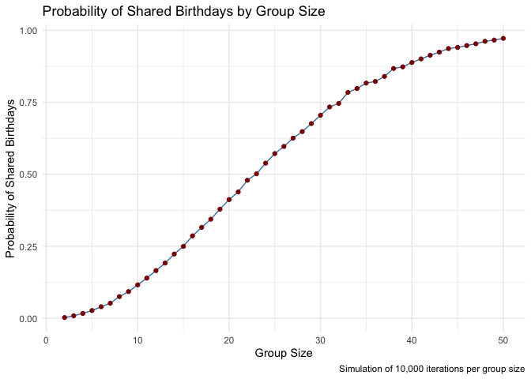
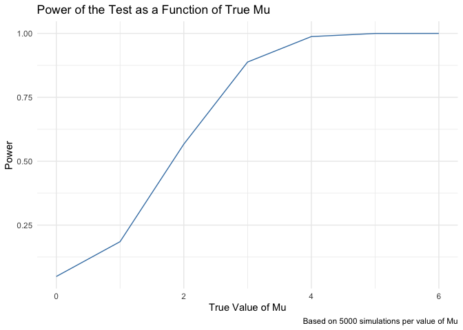
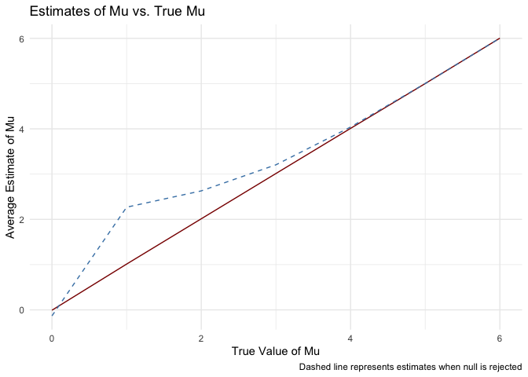

P8105 Homework 5
================
Vaiju Raja (vr2576)
2024-11-15

``` r
library(tidyverse)
```

    ## ── Attaching core tidyverse packages ──────────────────────── tidyverse 2.0.0 ──
    ## ✔ dplyr     1.1.4     ✔ readr     2.1.5
    ## ✔ forcats   1.0.0     ✔ stringr   1.5.1
    ## ✔ ggplot2   3.5.1     ✔ tibble    3.2.1
    ## ✔ lubridate 1.9.3     ✔ tidyr     1.3.1
    ## ✔ purrr     1.0.2     
    ## ── Conflicts ────────────────────────────────────────── tidyverse_conflicts() ──
    ## ✖ dplyr::filter() masks stats::filter()
    ## ✖ dplyr::lag()    masks stats::lag()
    ## ℹ Use the conflicted package (<http://conflicted.r-lib.org/>) to force all conflicts to become errors

``` r
library(rvest)
```

    ## 
    ## Attaching package: 'rvest'
    ## 
    ## The following object is masked from 'package:readr':
    ## 
    ##     guess_encoding

``` r
library(broom)

set.seed(1)
```

## Problem 1: Birthday Simulation

``` r
# Create the function to simulate birthday matches within a group of size n
birthday_sim <- function(n) {
  birthdays <- sample(1:365, size = n, replace = TRUE)  # Simulate birthdays for n people, assuming 365 unique days
  return(any(duplicated(birthdays)))  # Check for duplicates
}


# Simulation probability of a shared birthday for group sizes 2 to 50
group_sizes <- 2:50 # Group size from 2 to 50
num_sims <- 10000 # Number of simulations

# Calculate average probability of shared birthdays for each group size
results <- map_dbl(group_sizes, function(n) {
  simulations <- replicate(num_sims, birthday_sim(n))
  mean(simulations) # Prop of simulations with at least one shared birthday
})

# Data frame for plotting
results_df <- tibble(group_size = group_sizes, probability = results)

# Plot probability of shared birthdays by group size
results_df %>%
  ggplot(aes(x = group_size, y = probability)) +
  geom_line(color = "steelblue") +
  geom_point(color = "darkred") + 
  labs(title = "Probability of Shared Birthdays by Group Size",
    x = "Group Size",
    y = "Probability of Shared Birthdays",
    caption = "Simulation of 10,000 iterations per group size") +
  theme_minimal()
```

<!-- -->

The probability of having at least two people with shared birthdays in a
group increases as the group size grows. This trend is clearly shown by
the upward slope in the line plot, reflecting how the “birthday paradox”
effect amplifies with larger groups.

## Problem 2: Power Analysis with T-tests

``` r
## Generating Data and Running Tests for 𝜇 = 0
n <- 30  # Sample size
sigma <- 5  # sd
mu <- 0  # Mean under the null hypothesis
num_sims <- 5000  # Number of simulations

# Simulate data under the null hypothesis (𝜇 = 0)
simulate_data <- replicate(num_sims, rnorm(n, mean = mu, sd = sigma))

# Perform one-sample t-tests on each simulated sample
ttest_results <- apply(simulate_data, 2, function(sample) {
  t_test <- t.test(sample, mu = 0)  # Test if 𝜇 = 0
  tidy(t_test)
}) %>%
  bind_rows()

# Calculate prop of p < 0.05 (statistical power)
power <- mean(ttest_results$p.value < 0.05)
cat("Estimated power for 𝜇 = 0:", power, "\n")
```

    ## Estimated power for 𝜇 = 0: 0.05

``` r
## Repeat for Different Values of 𝜇
# Simulate power across multiple values of 𝜇
mu_values <- 0:6

# Generate power estimates for each value of 𝜇
power_results <- map_dfr(mu_values, function(mu) {
  data <- replicate(num_sims, rnorm(n, mean = mu, sd = sigma))

  ttest_results <- apply(data, 2, function(sample) {
    t_test <- t.test(sample, mu = 0)
    tidy(t_test)
  }) %>%
    bind_rows()

  power <- mean(ttest_results$p.value < 0.05)
  avg_mu_hat <- mean(ttest_results$estimate)
  avg_mu_hat_rejected <- mean(ttest_results$estimate[ttest_results$p.value < 0.05])

  tibble(mu = mu, power = power, avg_mu_hat = avg_mu_hat, avg_mu_hat_rejected = avg_mu_hat_rejected)
})

# Plot power as a function of the true value of 𝜇
power_results %>%
  ggplot(aes(x = mu, y = power)) +
  geom_line(color = "steelblue") +
  labs(title = "Power of the Test as a Function of True Mu",
    x = "True Value of Mu",
    y = "Power",
    caption = "Based on 5000 simulations per value of Mu") +
  theme_minimal()
```

<!-- -->

``` r
# Plot estimates of 𝜇
power_results %>%
  ggplot(aes(x = mu)) +
  geom_line(aes(y = avg_mu_hat), color = "darkred", linetype = "solid") +
  geom_line(aes(y = avg_mu_hat_rejected), color = "steelblue", linetype = "dashed") +
  labs(title = "Estimates of Mu vs. True Mu",
    x = "True Value of Mu",
    y = "Average Estimate of Mu",
    caption = "Dashed line represents estimates when null is rejected") +
  theme_minimal()
```

<!-- --> **Power of the
Test as a Function of True Mu** As the true value of mu increases, the
power of the test also increases, indicating greater likelihood of
correctly rejecting the null hypothesis. The plot shows the power
nearing 1 between mu = 4 and mu = 6, highlighting robust detection
capabilities at higher effect sizes.

**Estimates of Mu vs. True Mu** This plot compares the average estimated
values of mu with the true values. It demonstrates that the average
estimate converges more closely with the true value of mu starting
around mu = 2. For example, when the true value of mu is 1, the average
estimate is approximately 2, indicating some bias in the estimates at
lower mu values.
