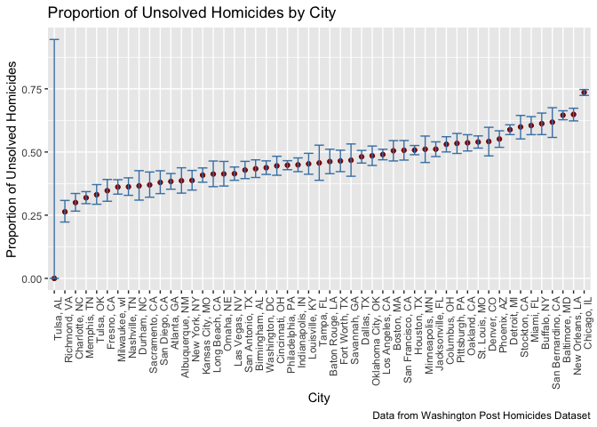

P8105 Homework 5
================
Vaiju Raja (vr2576)
2024-11-15

``` r
library(tidyverse)
```

    ## ── Attaching core tidyverse packages ──────────────────────── tidyverse 2.0.0 ──
    ## ✔ dplyr     1.1.4     ✔ readr     2.1.5
    ## ✔ forcats   1.0.0     ✔ stringr   1.5.1
    ## ✔ ggplot2   3.5.1     ✔ tibble    3.2.1
    ## ✔ lubridate 1.9.3     ✔ tidyr     1.3.1
    ## ✔ purrr     1.0.2     
    ## ── Conflicts ────────────────────────────────────────── tidyverse_conflicts() ──
    ## ✖ dplyr::filter() masks stats::filter()
    ## ✖ dplyr::lag()    masks stats::lag()
    ## ℹ Use the conflicted package (<http://conflicted.r-lib.org/>) to force all conflicts to become errors

``` r
library(rvest)
```

    ## 
    ## Attaching package: 'rvest'
    ## 
    ## The following object is masked from 'package:readr':
    ## 
    ##     guess_encoding

``` r
library(broom)

set.seed(1)
```

## Problem 1: Birthday Simulation

``` r
# Create the function to simulate birthday matches within a group of size n
birthday_sim <- function(n) {
  birthdays <- sample(1:365, size = n, replace = TRUE)  # Simulate birthdays for n people, assuming 365 unique days
  return(any(duplicated(birthdays)))  # Check for duplicates
}


# Simulation probability of a shared birthday for group sizes 2 to 50
group_sizes <- 2:50 # Group size from 2 to 50
num_sims <- 10000 # Number of simulations

# Calculate average probability of shared birthdays for each group size
results <- map_dbl(group_sizes, function(n) {
  simulations <- replicate(num_sims, birthday_sim(n))
  mean(simulations) # Prop of simulations with at least one shared birthday
})

# Data frame for plotting
results_df <- tibble(group_size = group_sizes, probability = results)

# Plot probability of shared birthdays by group size
results_df %>%
  ggplot(aes(x = group_size, y = probability)) +
  geom_line(color = "steelblue") +
  geom_point(color = "darkred") + 
  labs(title = "Probability of Shared Birthdays by Group Size",
    x = "Group Size",
    y = "Probability of Shared Birthdays",
    caption = "Simulation of 10,000 iterations per group size") +
  theme_minimal()
```

<!-- -->

**Probability of Shared Birthdays by Group Size:**

The probability of having at least two people with shared birthdays in a
group increases as the group size grows. This trend is clearly shown by
the upward slope in the line plot, reflecting how the “birthday paradox”
effect amplifies with larger groups.

## Problem 2: Power Analysis with T-tests

``` r
## Generating Data and Running Tests for 𝜇 = 0
n <- 30  # Sample size
sigma <- 5  # sd
mu <- 0  # Mean under the null hypothesis
num_sims <- 5000  # Number of simulations

# Simulate data under the null hypothesis (𝜇 = 0)
simulate_data <- replicate(num_sims, rnorm(n, mean = mu, sd = sigma))

# Perform one-sample t-tests on each simulated sample
ttest_results <- apply(simulate_data, 2, function(sample) {
  t_test <- t.test(sample, mu = 0)  # Test if 𝜇 = 0
  tidy(t_test)
}) %>%
  bind_rows()

# Calculate prop of p < 0.05 (statistical power)
power <- mean(ttest_results$p.value < 0.05)
cat("Estimated power for 𝜇 = 0:", power, "\n")
```

    ## Estimated power for 𝜇 = 0: 0.05

``` r
## Repeat for Different Values of 𝜇
# Simulate power across multiple values of 𝜇
mu_values <- 0:6

# Generate power estimates for each value of 𝜇
power_results <- map_dfr(mu_values, function(mu) {
  data <- replicate(num_sims, rnorm(n, mean = mu, sd = sigma))

  ttest_results <- apply(data, 2, function(sample) {
    t_test <- t.test(sample, mu = 0)
    tidy(t_test)
  }) %>%
    bind_rows()

  power <- mean(ttest_results$p.value < 0.05)
  avg_mu_hat <- mean(ttest_results$estimate)
  avg_mu_hat_rejected <- mean(ttest_results$estimate[ttest_results$p.value < 0.05])

  tibble(mu = mu, power = power, avg_mu_hat = avg_mu_hat, avg_mu_hat_rejected = avg_mu_hat_rejected)
})

# Plot power as a function of the true value of 𝜇
power_results %>%
  ggplot(aes(x = mu, y = power)) +
  geom_line(color = "steelblue") +
  labs(title = "Power of the Test as a Function of True Mu",
    x = "True Value of Mu",
    y = "Power",
    caption = "Based on 5000 simulations per value of Mu") +
  theme_minimal()
```

<!-- -->

``` r
# Plot estimates of 𝜇
power_results %>%
  ggplot(aes(x = mu)) +
  geom_line(aes(y = avg_mu_hat), color = "darkred", linetype = "solid") +
  geom_line(aes(y = avg_mu_hat_rejected), color = "steelblue", linetype = "dashed") +
  labs(title = "Estimates of Mu vs. True Mu",
    x = "True Value of Mu",
    y = "Average Estimate of Mu",
    caption = "Dashed line represents estimates when null is rejected") +
  theme_minimal()
```

<!-- -->

**Power of the Test as a Function of True Mu:**

As the true value of mu increases, the power of the test also increases,
indicating greater likelihood of correctly rejecting the null
hypothesis. The plot shows the power nearing 1 between mu = 4 and mu =
6, highlighting robust detection capabilities at higher effect sizes.

**Estimates of Mu vs. True Mu:**

This plot compares the average estimated values of mu with the true
values. It demonstrates that the average estimate converges more closely
with the true value of mu starting around mu = 2. For example, when the
true value of mu is 1, the average estimate is approximately 2,
indicating some bias in the estimates at lower mu values.

## Problem 3: Homicide Data Analysis

``` r
# Load data from url
url <- "https://raw.githubusercontent.com/washingtonpost/data-homicides/master/homicide-data.csv"
homicides <- read_csv(url)

# Create city-state identifier
homicides <- homicides %>%
  mutate(city_state = paste(city, state, sep = ", "))

# Summarize total and unsolved homicides per city
summary_df <- homicides %>%
  group_by(city_state) %>%
  summarise(total_homicides = n(),
    unsolved_homicides = sum(disposition %in% c("Closed without arrest", "Open/No arrest")))


## Prop test for Baltimore, MD
# Filter for Baltimore data
baltimore <- summary_df %>% filter(city_state == "Baltimore, MD")

# Perform the prop test
prop_test_baltimore <- prop.test(baltimore$unsolved_homicides, baltimore$total_homicides)

# Tidying the result and extracting key values
prop_test_tidy_baltimore <- broom::tidy(prop_test_baltimore)
print(prop_test_tidy_baltimore)
```

    ## # A tibble: 1 × 8
    ##   estimate statistic  p.value parameter conf.low conf.high method    alternative
    ##      <dbl>     <dbl>    <dbl>     <int>    <dbl>     <dbl> <chr>     <chr>      
    ## 1    0.646      239. 6.46e-54         1    0.628     0.663 1-sample… two.sided

``` r
## Prop tests for all cities and visualization
city_results <- summary_df %>%
  rowwise() %>%  
  mutate(prop_test = list(prop.test(unsolved_homicides, total_homicides)),  # Run prop.test and store results as a list
    tidy_result = list(broom::tidy(prop_test))  # Tidy prop.test output
  ) %>%
  unnest(tidy_result)  # Unnest tidy result for each city to get clean data frame
print(city_results)
```

    ## # A tibble: 51 × 12
    ##    city_state    total_homicides unsolved_homicides prop_test estimate statistic
    ##    <chr>                   <int>              <int> <list>       <dbl>     <dbl>
    ##  1 Albuquerque,…             378                146 <htest>      0.386   19.1   
    ##  2 Atlanta, GA               973                373 <htest>      0.383   52.5   
    ##  3 Baltimore, MD            2827               1825 <htest>      0.646  239.    
    ##  4 Baton Rouge,…             424                196 <htest>      0.462    2.27  
    ##  5 Birmingham, …             800                347 <htest>      0.434   13.8   
    ##  6 Boston, MA                614                310 <htest>      0.505    0.0407
    ##  7 Buffalo, NY               521                319 <htest>      0.612   25.8   
    ##  8 Charlotte, NC             687                206 <htest>      0.300  109.    
    ##  9 Chicago, IL              5535               4073 <htest>      0.736 1231.    
    ## 10 Cincinnati, …             694                309 <htest>      0.445    8.11  
    ## # ℹ 41 more rows
    ## # ℹ 6 more variables: p.value <dbl>, parameter <int>, conf.low <dbl>,
    ## #   conf.high <dbl>, method <chr>, alternative <chr>

``` r
# Plot prop of unsolved homicides by city
city_results %>%
  ggplot(aes(x = reorder(city_state, estimate), y = estimate)) +
  geom_point(color = "darkred") +
  geom_errorbar(aes(ymin = conf.low, ymax = conf.high), color = "steelblue") +
  labs(title = "Proportion of Unsolved Homicides by City",
    x = "City",
    y = "Proportion of Unsolved Homicides",
    caption = "Data from Washington Post Homicides Dataset") +
  theme(axis.text.x = element_text(angle = 90, hjust = 1)) 
```

<!-- -->

**Prop test for Baltimore, MD:**

In Baltimore, MD, the estimated proportion of unsolved homicides is
0.646 (95% CI: 0.628–0.663), indicating a high prevalence of unsolved
cases. The p-value for this test is extremely small, suggesting strong
evidence that the true proportion differs from 0.5 or any other null
hypothesis proportion being tested.

**Proportion of Unsolved Homicides by City:**

Chicago, IL, shows the highest proportion of unsolved homicides among
cities analyzed, while Tulsa, OK, has the lowest. However, Tulsa’s
confidence interval is wide, indicating greater uncertainty in this
estimate, potentially due to smaller sample size or data variability.
After Chicago, New Orleans, LA and Baltimore, MD have the second and
third highest proportion of unsolved homicides.
